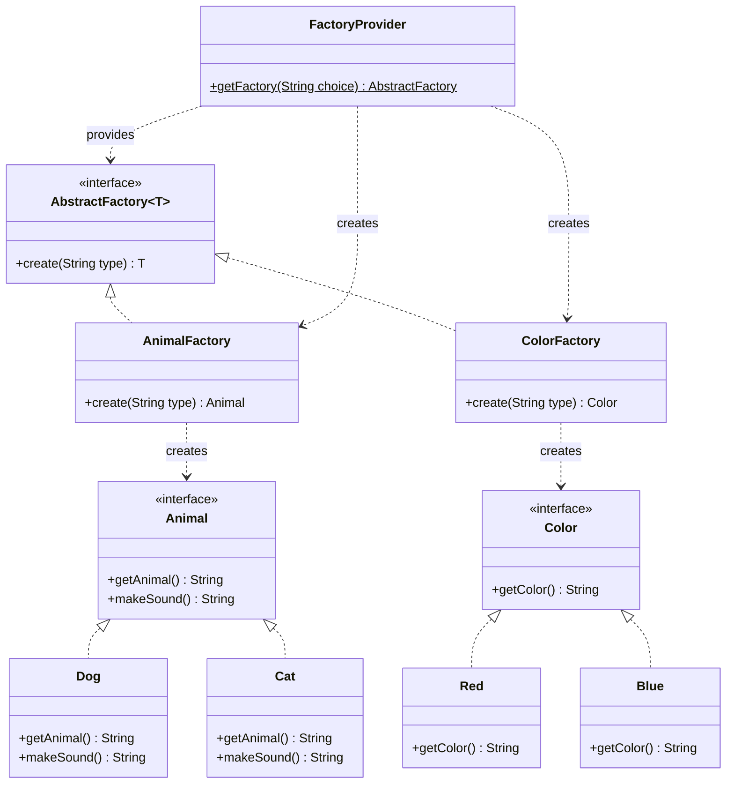

# Abstract Factory Pattern

* The *Abstract Factory Pattern* is a Creational design pattern and is part of the GoF‘s formal list of design patterns.
* Abstract Factory provides an interface for creating families of related or dependent objects without specifying their concrete classes.

## When to Use Abstract Factory Pattern:
* The client is independent of how we create and compose the objects in the system.
* The system consists of multiple families of objects, and these families are designed to be used together.
* We need a run-time value to construct a particular dependency.

## Implementation Example in this Project
This project demonstrates the Abstract Factory Pattern using two families of objects: **Animals** and **Colors**.

### Key Components:
1. **AbstractFactory (`AbstractFactory<T>`)**: A generic interface with a `create(String type)` method.
2. **Concrete Factories**:
   - `AnimalFactory`: Implements `AbstractFactory<Animal>`. Creates `Dog` and `Cat` objects.
   - `ColorFactory`: Implements `AbstractFactory<Color>`. Creates `Red` and `Blue` objects.
3. **Products**:
   - **Animal Family**: `Animal` (Interface) -> `Dog`, `Cat`
   - **Color Family**: `Color` (Interface) -> `Red`, `Blue`
4. **Factory Provider (`FactoryProvider`)**: A utility class to get the appropriate factory (`Animal` or `Color`) based on user choice.

## Class Diagram

