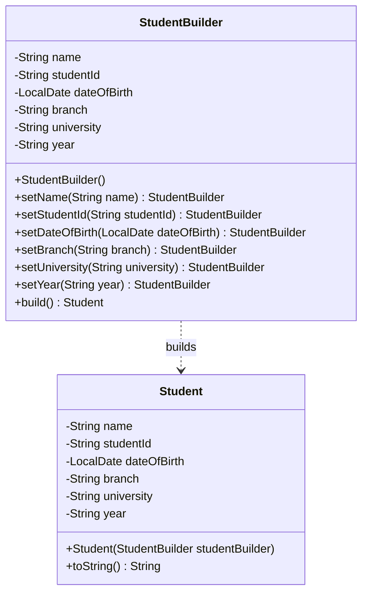

# Builder Pattern

* The *Builder Pattern* is a Creational design pattern and is part of the GoF‘s formal list of design patterns.
* Builder pattern solves the issue with large number of optional parameters and inconsistent state by providing a way to build the object step-by-step and provide a method that will actually return the final Object.

## When to Use Builder Pattern

* When constructing an object requires passing a large number of parameters to its constructor, making the code hard to read and prone to errors.
* When you need to create different representations of some product.
* When you want to construct complex objects step by step.
* When the object has many optional parameters.

## Implementation Example in this Project

This project demonstrates the Builder Pattern using the `Student` class and its static inner class `StudentBuilder`.

### Key Components:
1. **Target Class (`Student`)**: The complex object to be built. Its constructor takes the builder object to assign all fields.
2. **Builder Class (`StudentBuilder`)**: A static inner class that contains the exact same fields as the target class. It provides fluent setter methods that return the builder instance itself (`this`).
3. **`build()` Method**: The final step in the chain that calls the constructor of the target class, passing the fully configured builder object.

## Example Usage

```java
// 1. Create a Builder and chain the setter methods
Student student = new Student.StudentBuilder()
        .setName("Jay")
        .setStudentId("123456789")
        .setDateOfBirth(LocalDate.of(2000, 1, 1))
        .setBranch("Computer Science")
        .setUniversity("University of Technology")
        .setYear("2023")
        .build(); // 2. Call build() to get the final object

// 3. The object is safely constructed
System.out.println(student); // Output: Jay::123456789
```

## Class Diagram

