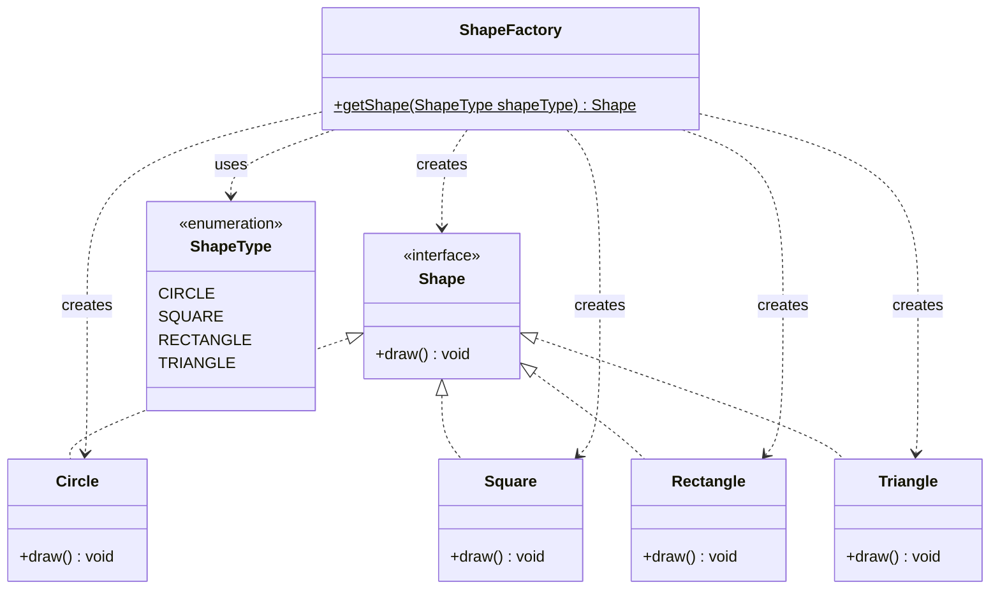

# Factory Design Pattern

* The *Factory Pattern* is a Creational design pattern and is part of the GoF‘s formal list of design patterns.
* This pattern defines an interface for creating an object, but let subclasses decide which class to instantiate.
* This pattern delegates the responsibility of initializing a class from the client to a particular factory class by creating a type of virtual constructor.

## Implementation Example in this Project
This project demonstrates the Factory Pattern using a hierarchy of **Shapes**.

### Key Components:
1. **Product Interface (`Shape`)**: Defines the `draw()` method that all concrete shapes must implement.
2. **Concrete Products**: `Circle`, `Rectangle`, `Square`, `Triangle` which implement the `Shape` interface.
3. **Shape Type Enum (`ShapeType`)**: An enumeration (`CIRCLE`, `RECTANGLE`, `SQUARE`, `TRIANGLE`) used to request specific shapes in a type-safe way.
4. **Factory (`ShapeFactory`)**: Contains a static method `getShape(ShapeType)` that acts as the virtual constructor, instantiating and returning the correct `Shape` instance.

## When to Use Factory Pattern

* When the implementation of an interface or an abstract class is expected to change frequently
* When the current implementation cannot comfortably accommodate new change
* When the initialization process is relatively simple, and the constructor only requires a handful of parameters

## Class Diagram

