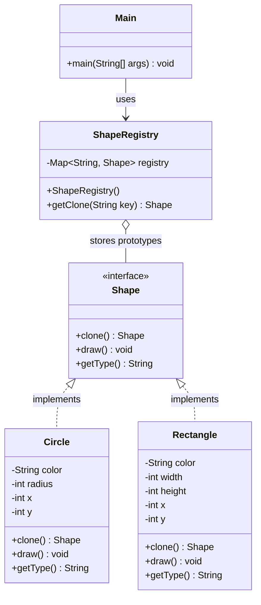

# Prototype Pattern

* The *Prototype Pattern* is a Creational design pattern and is part of the GoF's formal list of design patterns.
* Prototype pattern is used when the type of objects to create is determined by a prototypical instance, and new objects are created by **cloning** (copying) this prototype rather than invoking a constructor.
* It is particularly useful when object creation is expensive (e.g. involves database calls, complex computation, or deep object graphs) and a similar object already exists that can be copied and tweaked instead.

## When to use Prototype Pattern

* The classes to instantiate are specified at run-time, for example by dynamic loading.
* Object creation is costly (e.g. requires heavy I/O, network calls, or complex initialisation) and a near-identical object already exists.
* You want to avoid building a class hierarchy of factories that mirrors the class hierarchy of products.
* Instances of a class can have only a few different combinations of state, and it is more convenient to clone a preset prototype than to instantiate it manually each time.

## Participants

| Role | Responsibility |
|---|---|
| **Prototype** | Declares an interface (typically a `clone()` method) for cloning itself. |
| **ConcretePrototype** | Implements the `clone()` operation to copy itself. |
| **Client** | Creates a new object by asking the prototype to clone itself, rather than calling a constructor directly. |

## Class Diagram

