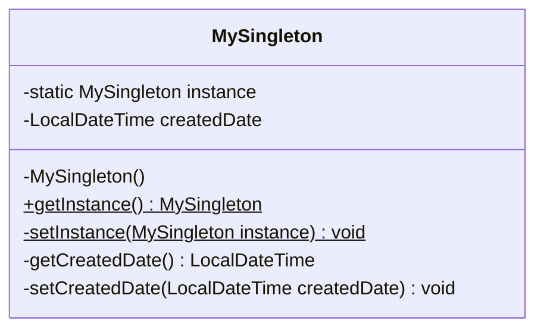

# Singleton Pattern

* The *Singleton Pattern* is a Creational design pattern and is part of the GoF‘s formal list of design patterns.
* This pattern aims to keep a check on initialization of objects of a particular class by ensuring that only one instance of the object exists throughout the Java Virtual Machine.
* A Singleton class also provides one unique global access point to the object so that each subsequent call to the access point returns only that particular object.

## Implementation Example in this Project
This project demonstrates the Singleton Pattern using the `MySingleton` class, which employs **double-checked locking** to ensure thread safety while maintaining high performance.

### Key Components:
1. **Private Constructor**: Prevents direct instantiation of the object from outside the class.
2. **Private Static Variable (`instance`)**: Holds the single instance of the class.
3. **Public Static Method (`getInstance`)**: Provides the global access point to the singleton object. It uses a `synchronized` block internally to ensure thread safety only during the initial creation (double-checked locking mechanism).

## Example Usage
```java
// 1. Get the single instance
MySingleton singleton1 = MySingleton.getInstance();
MySingleton singleton2 = MySingleton.getInstance();

// 2. Both references point to the exact same object in memory
System.out.println(singleton1 == singleton2); // Output: true
```

## When to Use Singleton Design Pattern

* For resources that are expensive to create (like database connection objects)
* It's good practice keeping all loggers as Singletons which increases performance
* Classes which provide access to configuration settings for the application
* Classes that contain resources that are accessed in shared mode

## Class Diagram


